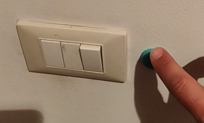
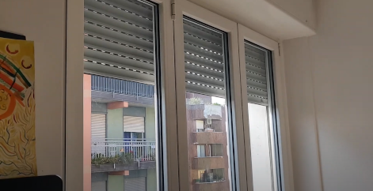

MY-SMART-HOME
=============

# Controlling LIFX with FLIC smart-buttons

[](https://youtube.com/shorts/Z6pzKkCa6y0?feature=share)

# Controlling TASMOTA on schedule

[](https://youtu.be/ER47l3pQupE?feature=share)


# DOCKER

On Raspberry PI 4 Model B

```
docker run -d --restart unless-stopped --network host --privileged -v [YOUR_FLICDB_PATH]:/config/flicd.db -v [YOUR_LOG_PATH]:/var/log/log.out totocastaldi/my-smart-home-flicd:raspberry4b
docker run -d --restart unless-stopped --network host -v [YOUR_LOG_PATH]:/var/log/log.out -v [YOUR_LISTENER_LOGIC]:/app/flic_listener.py totocastaldi/my-smart-home-flic-listener:raspberry4b
docker run -d --restart unless-stopped --network host -v [YOUR_LOG_PATH]:/var/log/log.out -v [YOUR_BATCH_LOGIC]:/app/batch.py totocastaldi/my-smart-home-batch:raspberry4b
```

batch.py example

```python
import schedule
import tasmota
import lifx

def all_off():
    tasmota.power_on("192.168.100.32", 2)
    lifx.all_off()

if __name__ == '__main__':        
    schedule.every().day.at("18:44").do(all_off)
    

    while True:
        schedule.run_pending()
        time.sleep(1)

```

config.json example

```python
import lifx
import flic
import utils

logger = utils.init_log()

def button_event(bd_addr, click_type):
	logger.debug(f"{bd_addr} -> {click_type}")
	if bd_addr == "80:a3:d1:13:34:12":
		if click_type == "ClickType.ButtonHold":
			lifx.toggle("LIFX A19 1234")

flic.listen(button_event)
```

# DEV

With [Flic library](https://github.com/50ButtonsEach/fliclib-linux-hci)

```bash
[FLIC_LIB_PATH]/flicd -f [FLIC_DB_PATH]
```

## PYTHON

```bash
if [ ! -d ".venv" ]
then
    pyenv install 3.9.5
    pyenv local 3.9.5 
    pip install virtualenv
    virtualenv .venv
fi
```

## SCAN

```bash
. .venv/bin/activate
pip install -r requirements.txt
python scan_wizard.py
```

## FLIC_LISTENER

```bash
. .venv/bin/activate
pip install -r requirements.txt
LOG_LEVEL=DEBUG python flic_listener.py
```
## BATCH

```bash
. .venv/bin/activate
pip install -r requirements.txt
LOG_LEVEL=DEBUG python batch.py
```